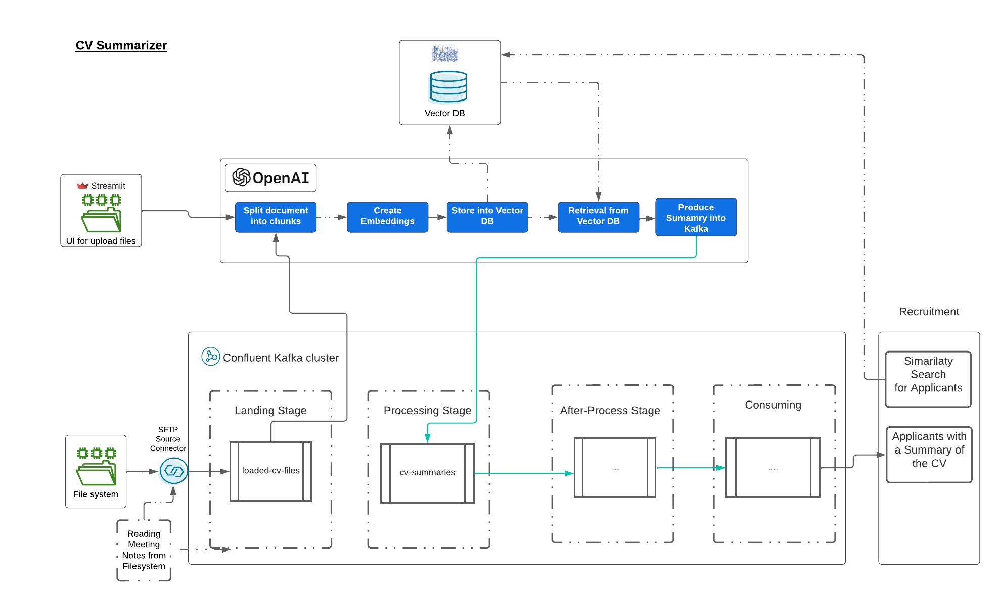
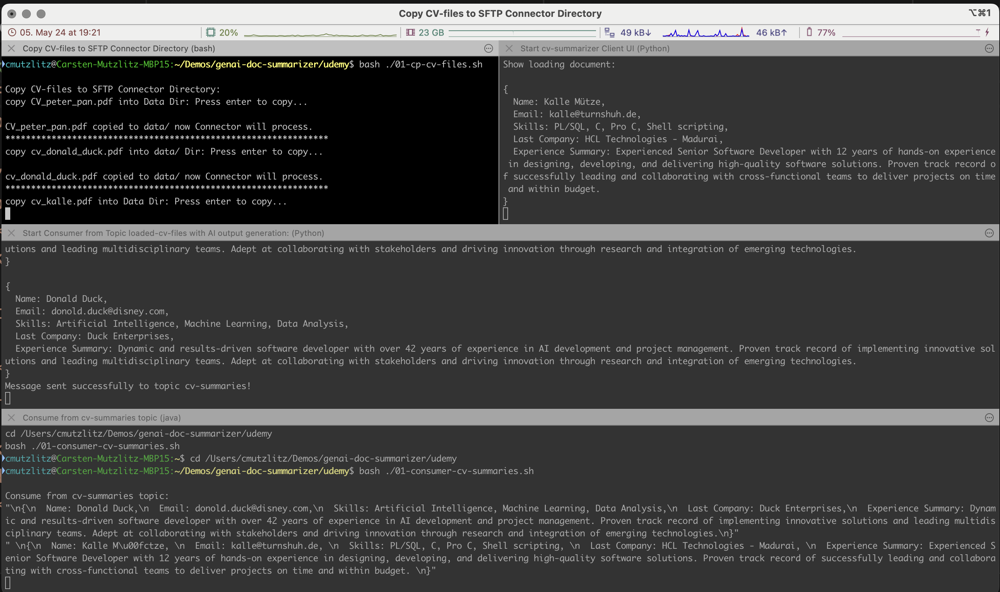
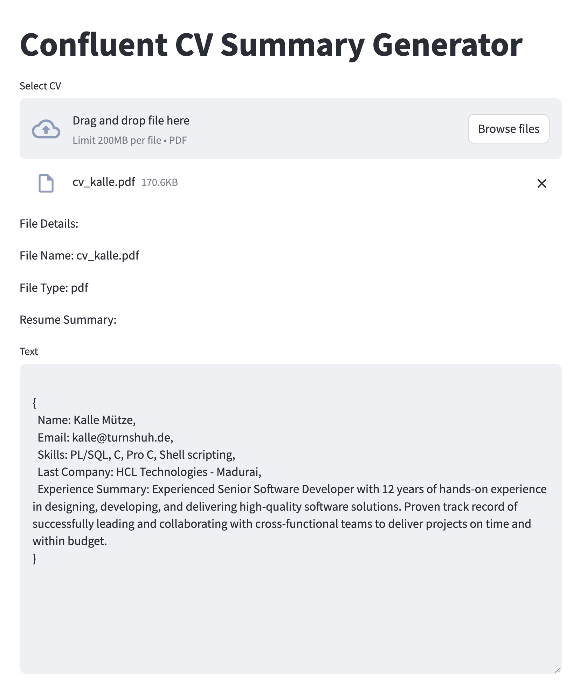

# Confluent CV Summarizer with RAG pattern

In this demo we will use a SFTP Connector and a UI (simple streamlit APP) to load PDF Files (CV) and generate a cv summary on a given format.
The PDF will be split into chunks and loaded as embeddings into something like a vector DB. We will use FAISS here (no costs). It is not a real vector DB. But for this case more than enough.
We store chunks so that we can use it later for similarity search: Show me all Java Developers (not covered yet).

The demo is very simple and should be used as a starter.

We follow this architecture

 
# pre-req
* CP installed, I am going with Confluent Platform 7.6
* Confluent cli installed
* install SFTP Connector: `confluent-hub install confluentinc/kafka-connect-sftp:3.2.1`
* java installed at least 1.8
* Python 3 installed with the following python packages
```bash
pip3 install openai
pip3 install streamlit
pip3 install ast, os, json
pip3 install kafka
pip3 install -U langchain-openai
pip3 install -U langchain-openai langchain
pip3 install -U langchain-community
pip3 install -U langchain-community faiss-cpu langchain-openai
pip3 install -U langchain-openai
```

* iterm2 installed, to run the demo automatically, otherwise call each program manually.
* Having an Open AI Api Key. If not, create an OpenAI API Key ([https://platform.openai.com/docs/quickstart/account-setup?context=python]()) 

copy the OpenAI Key to `.env` file:

```bash
cat > $PWD/.env <<EOF
export OPENAI_API_KEY=YOUR openAI Key
export PDFFILE=/your-demo-path/temp/cv.pdf
EOF
```

And finally change the paths and SFTP Setup in `jsonsftp.properties `file:

```bash
input.path=/PATH/data
error.path=/PATH/error
finished.path=/PATH/finished
...
sftp.username=sftpuser
sftp.password=PW
sftp.host=your host
sftp.port=22
```

When you run the SFTP Connector on your Mac, you just need to add a new user, and enable Remote Login. (Switch it off, after Demo)

# AI Demo Confluent CV Summarizer

We will run a demo with the possibility to upload a CV on different ways:

* via UI: In this case we will take the CV, split the document and add into a kind of vector DB (here local FAISS) and generate the summary and put the summary into topic cv-summaries
* or via SFTP Connector to just download the file into the topic loaded-cv-files, a second client consumer will consume from topic loaded-cv-files split the document and add into a kind of vector DB (here local FAISS) and generate the summary and put the summary into topic cv-summaries

Start the Demo by executing:

```bash
./00_start_ai_demo.sh
```

A terminal Window will opened automatically and show the following window sessions:


* First: Session to copy files to data directory, from there the SFTP Connector will take it (Names are unique, a file with the same name, will be processed once)
* Second: Start UI. This windows shows results as print-outs and doing genAI CV-Summary generation and produce to topic cv-summaries. But you need to upload the file via [UI](http://localhost:8501/)
* Third: genAI CV-Summarizer Consumer reading from Topic `loaded-cv-files` and doing genAI CV-Summary generation and produce to topic `cv-summaries`
* Fourth: simple consumer from topic `cv-summaries` to show again the generated content which was stored in mentioned topic `cv-summaries`

The UI Demo looks like the next image, and show immediately after file-loading the result.


To work with UI go to [http://localhost:8501/](http://localhost:8501/)

Play around and have fun (-:

# Delete Demo

run the following command:

```bash
./02_stop_and_destroy_ai_demo.sh
```

Don't forget to switch off, Remote Login.